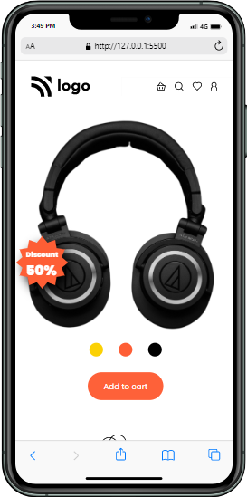
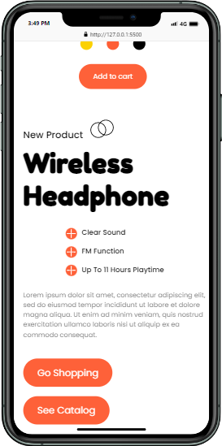
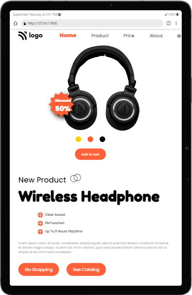
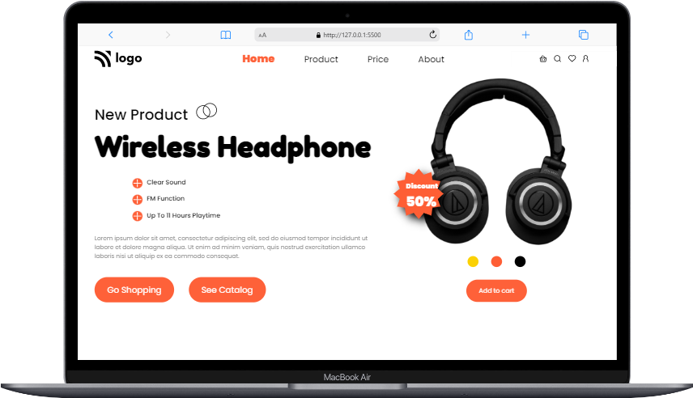
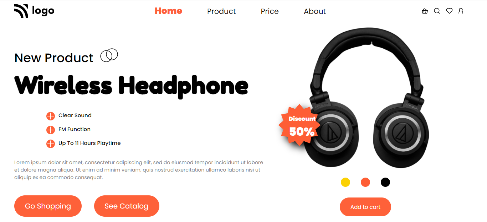

# Product Home Page

***
## Description

This project [Product Home Page](https://earphone-page.netlify.app/) was built using Semantic HTML and CSS. The main goal for building this webpage was to apply the concepts which I have learned in the bootcamp[FS Js Bootcamp, Ineuron] and make the webpage responsive for all major devices.The difficulty was faced while making webpage responsive with **@media queries**. Making the webpage responsive was way time-consuming but I learnt alot. The Project was completed under guidance of [Hitesh Choudhary](https://github.com/hiteshchoudhary), CTO Ineuron

***

### Links for Project

* [LIVE Project Link](https://earphone-page.netlify.app/)

* [Youtube Video Demo](https://youtu.be/fWQc-BGqx8I)

* [Source Code](https://github.com/ShubhamSingh03/Product-Home-Page)

***
### Built With 

* Semantic HTML
* Custom CSS classes
* FlexBox
* Positions
* Media Queries

***

### Key Learnings

* Learned using [flexbox](https://developer.mozilla.org/en-US/docs/Web/CSS/flex)
* Learned to use [z-index](https://developer.mozilla.org/en-US/docs/Web/CSS/z-index)
* Learned to use positions(absolute & relative) for two images on top of one another.
* Learned to make webpage responsive with the help of [media queries](https://developer.mozilla.org/en-US/docs/Web/CSS/Media_Queries/Using_media_queries)

***

### Time Taken to finish this project
 

>8 hours to style the webpage and make it responsive also.

 

***

### Screencaptures of Project

 

  1. #### Mobile View

 

 

  2. #### Tablet View 

   

  

   

  3. #### Large Screen View 

   

  

   

  4. #### Extra-large Screens View

   

  

   

***

### Checkout Portfolio & Other Projects

#### [Personal Portfolio](https://shubhambhoj.in/)

#### [Findcoder Profile](https://www.findcoder.io/u/shubham_singh)
***

### Connect with Me
* [Mailto](mailto:shubhambhoj3@gmail.com)
* [LinkedIn](https://www.linkedin.com/in/shubham-singh-b122b7171/)
* [Github](https://github.com/ShubhamSingh03)

***
***
[go to top](#product-home-page)